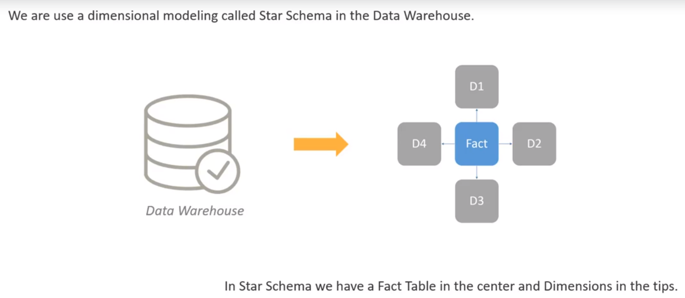
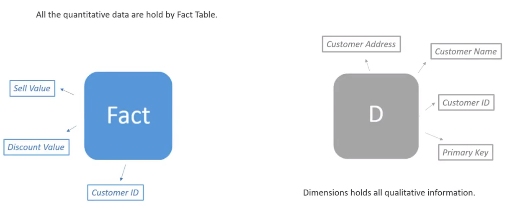
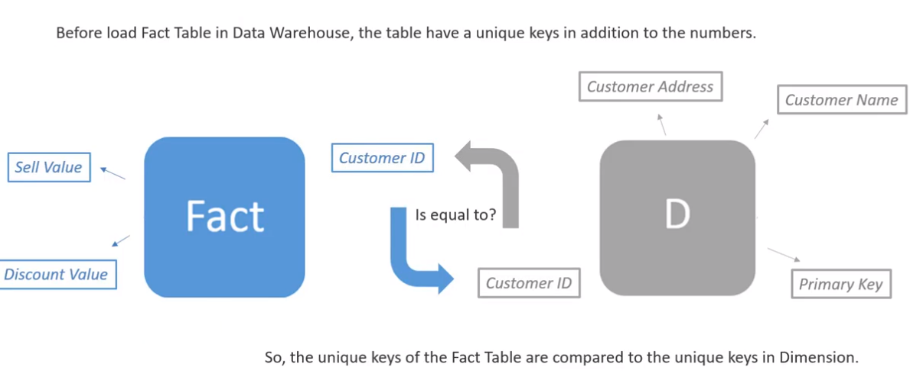
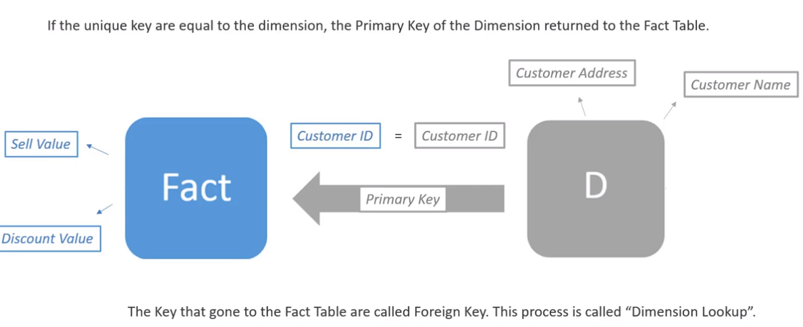
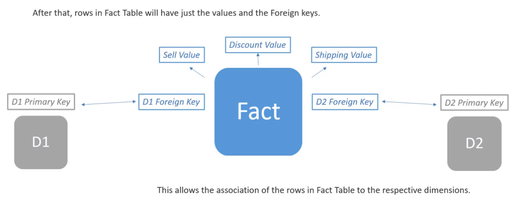
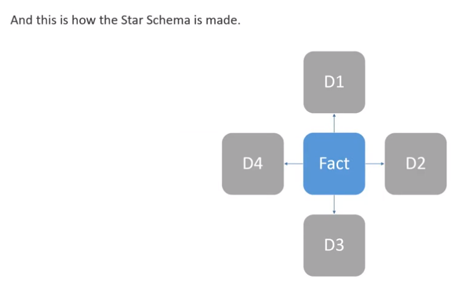
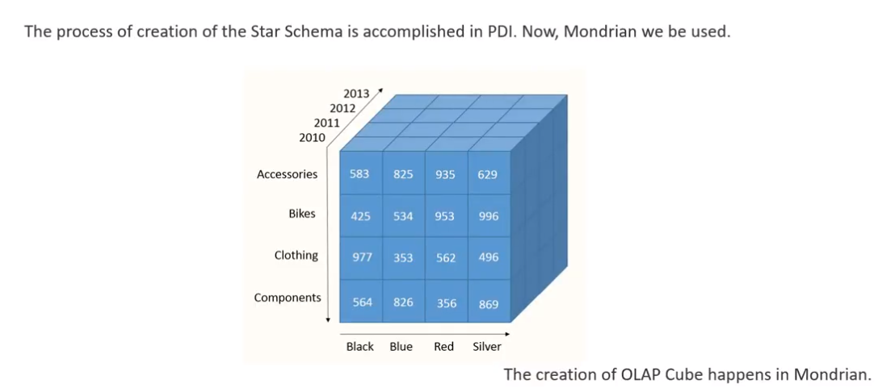
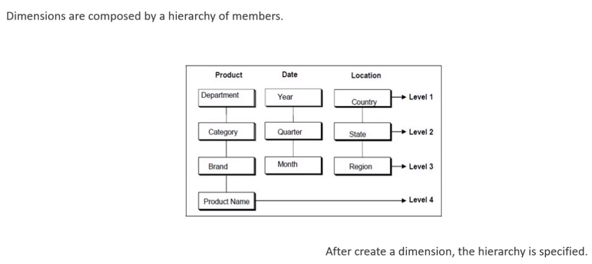
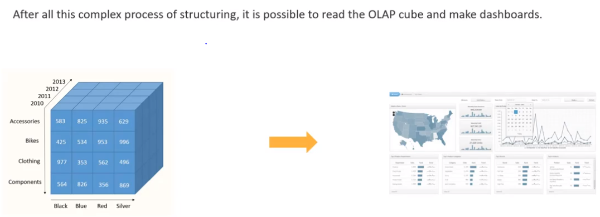
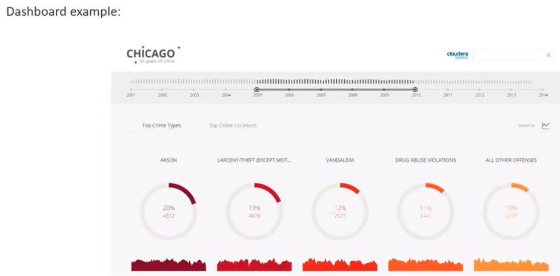

# ETL
Export Load Transform
***
***

This star schema is located in the Data Warehouse and is a way to relate tables.
On ETL process, first we create:
- **Stages**: For stages values, we also extract the uniques keys of the dimensions, the sell value, customer id, others.

- **Dimensions**: On dimension we can find all the qualitative data, for example on customer dimension we can find customer name, address, etc. Here we can have versions, this means that a customer can by duplicated with a diferent primary key and some updated information, but the same customer id.

- **Fact table**: Is a way to relate tables.In the fact table, we can find all the quantitative information that we want.

But before creating the fact table, we read the customer's database and extract all quantitative information before the stages values, which will become the fact table.

**OLAP Cube: Online Analytical Process**
It is a Cube assembled from the Star Schema, where the dimensions are the sides and the measurements are located on the center.
In the Mondrian also is specified the members and the hierarchy of the Dimensions.

